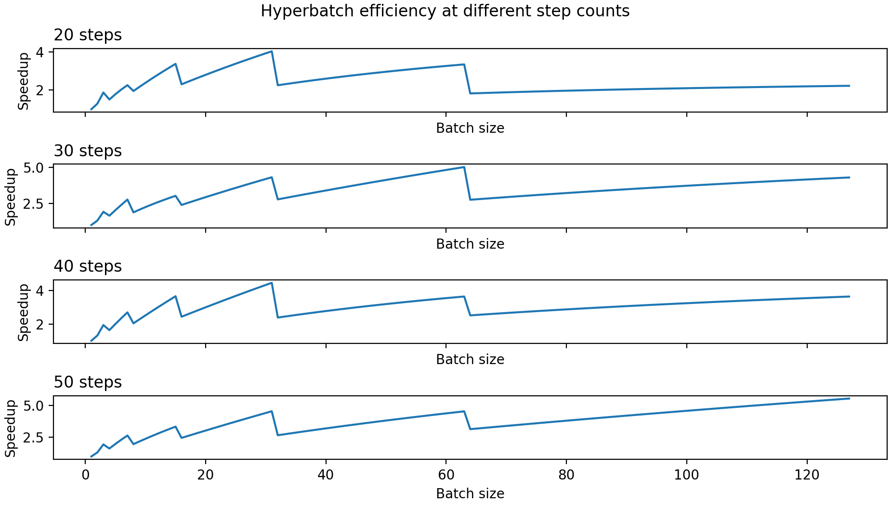

# sd-prompt-pinning

Pin a prompt to a visual target!

An extension for [AUTOMATIC1111's Stable Diffusion Web UI](https://github.com/AUTOMATIC1111/stable-diffusion-webui),
based on:
- [DEAP](https://github.com/DEAP/deap) for optimization algorithms
- [ꟻLIP](https://github.com/NVlabs/flip) as a basis for a custom loss function

## Problem

- Variation in prompts is hard to “pin down”: it can be difficult to tell which parts of the prompts are “locking in” a particular result.
  For example, a highly-specified prompt can produce results with little variation, even at lower CFG scales.
- Why is this useful?
    - Analyze larger prompts to tell which parts are “tighter” or “looser,” relative to a particular model, VAE, etc.
    - Refine precise prompts by eliminating certain variations.
    - Build “prompt pieces” for specifying particular behavior. E.g. prompt-based “bad hand” or “tarot card” embeddings.
    - Advanced:
        - Target images provide a simple way to pin to a particular image (i.e. for animation)
    - Unimplemented (at time of writing):
        - Target images that ignore an image mask, e.g. fix parts of an image for animation, solely using the prompt!
        - CLIP-based analysis to allow pinning a result to a particular (set of) goal tag(s)

## Solution

CMA (covariant matrix adaptation) is an efficient automatic evolutionary optimization method.
- It’s fit for problems where the input is a matrix and the metric is smooth.
- In practice, it converges exponentially.

Example run with 50 generations:
- Steps: "16"
- Size: "768x512"
- Duration: ~30 minutes
- Optimized for size because the original was `334.76 MB`

Final result (full quality):

## Features

- Hyperbatch samplers: generate batches more quickly and with better variance distribution for pinning!
  + `DPM++ 2M Karras - Hyperbatch`
  + `DPM++ SDE Karras - Hyperbatch`
  + `DPM++ SDE - Hyperbatch`
- Pinning targets
  + Visually pin to a generated batch
  + Visually pin to a fixed image or batch
  + (Coming soon?) Pin to a set of tags
  + (Coming soon?) Pin to a local map of weights using UMAP + HDBSCAN
- Generation settings
  + Multi-objective size limiter: limit the distance explored from the original prompt
  + Hyperbatch-specific weights:
    * Geometric
    * Exponential
    * Polynomial
- Analysis
  + Per-individual:
    * Statistics JSON
    * Loss plots (histogram, etc.)
    * Summary GIF
  + Per-generation:
    * Image loss distribution (and histogram)
    * Individual loss distribution (and histogram)
  + Per-run:
    * HTML summary pages for each (see [here](https://github.com/michaeljklein/sd-prompt-pinning-test-cases) for examples)
    * Evolution convergence plots

## Dependencies

This extension optionally depends on
[picobyte/stable-diffusion-webui-wd14-tagger](https://github.com/picobyte/stable-diffusion-webui-wd14-tagger)
for image tagging. (In progress: it may make more sense to use a different extension.)

## Guide

### Options

Parameter	                         | Default	                                               | Details
---------------------------------- | ------------------------------------------------------- | -----------------------------------------------------------------------------------------------------------------
Target Images                      | `None`                                                  | Use the provided image(s) as a target instead of the first generated batch
CMA Logging                        | `True`                                                  | Log CMA info to CLI (stdout)
CMA Seed                           | `[calculated from seed, subseed]`                       | Numpy seed, used for CMA sampling
Number of generations              | `int(16 * floor(log(N)))`                               | Number of generations
Initial population STD             | `0.05`                                                  | CMA initial population STD
Initial population radius          | `0.25`                                                  | Radius of uniform distribution for CMA initial population
Multi-objective size limiter       | `0`                                                     | Disabled when `0`. Apply a penalty using a multi-objective CMA when more than this distance from original prompt
Size limit error                   | `[size limiter] / 100`                                  | Error for multi-objective size limiter: vectors within this distance are "close"
Size limit weight                  | `[size limiter] * 10`                                   | Weight for multi-objective size limiter penalty
`lambda_`                          | `int(4 + 3 * log(N))`                                   | Number of children to produce at each generation, `N` is the individual's size (integer).
`mu`                               | `int(lambda_ / 2)`                                      | The number of parents to keep from the lambda children (integer).
`cmatrix`                          | `identity(N)`                                           | The initial covariance matrix of the distribution that will be sampled.
`weights`                          | `"superlinear"`                                         | Decrease speed, can be `"superlinear"`, `"linear"` or `"equal"`.
`cs`                               | `(mueff + 2) / (N + mueff + 3)`                         | Cumulation constant for step-size.
`damps`                            | `1 + 2 * max(0, sqrt((mueff - 1) / (N + 1)) - 1) + cs`  | Damping for step-size.
`ccum`                             | `4 / (N + 4)`                                           | Cumulation constant for covariance matrix.
`ccov1`                            | `2 / ((N + 1.3)^2 + mueff)`                             | Learning rate for rank-one update.
`ccovmu`                           | `2 * (mueff - 2 + 1 / mueff) / ((N + 2)^2 + mueff)`     | Learning rate for rank-mu update.
`Hyperbatch Weights Enabled`       | `True`                                                  | Enable 'Hyperbatch' weights
`Hyperbatch Weights Force Allowed` | `True`                                                  | Allow enabling 'Hyperbatch' weights when not using a 'Hyperbatch' sampler
`Hyperbatch Weight Type`           | `Geometric`                                             | Type of weights used for 'Hyperbatches'. See the Hyperbatch section for more detail.
`Hyperbatch Weight Scale`          | `1.0`                                                   | Weight scaling factor for 'Hyperbatches'. See the Hyperbatch section for more detail.

NOTE: Some parameters may not work when multi-objective size limiting is enabled.
The utilized CMA parameters for multi-objective optimization are as follows:
(Some options may not yet be available in the UI.)

 Parameter    | Default                 | Details                   
------------- | ----------------------- | ------------------------------------------------
 `mu`         | `len(population)`       | The number of parents to use in the evolution. 
 `lambda_`    | `1`                     | Number of children to produce at each generation 
 `d`          | `1.0 + N / 2.0`         | Damping for step-size.    
 `ptarg`      | `1.0 / (5 + 1.0 / 2.0)` | Target success rate.      
 `cp`         | `ptarg / (2.0 + ptarg)` | Step size learning rate.  
 `cc`         | `2.0 / (N + 2.0)`       | Cumulation time horizon.  
 `ccov`       | `2.0 / (N**2 + 6.0)`    | Covariance matrix learning rate.                     
 `pthresh`    | `0.44`                  | Threshold success rate.   

Ref. `Hansen and Ostermeier, 2001. Completely Derandomized Self-Adaptation in Evolution Strategies. Evolutionary Computation`

Because the `Number of generations` lacks a default in the original implementation,
the default was picked from the following observances:
- When the algorithm is efficient, the number of generations is proportional to `log(N)`
- From the example [`cma_minfct`](https://github.com/DEAP/deap/blob/master/examples/es/cma_minfct.py)
  and by eyeballing other examples, the multiplicative overhead is approximately `16` (when the algorithm is efficient)

### Hyperbatches

Hyperbatches are an experimental feature that no longer require a fork of
AUTOMATIC1111 Web UI!

The following samplers have been implemented in this extension:
- `DPM++ 2M Karras - Hyperbatch`
- `DPM++ SDE Karras - Hyperbatch`
- `DPM++ SDE - Hyperbatch`

Why?
- These samplers can be several times faster than their non-hyperbatch
  equivalents, dependent on the batch size and step count used. See the plot
  below for more details.
- These samplers are specifically designed to:
  + Expose more of the generation (in)stability to the evolutionary algorithm's
    metric
  + Take advantage of GPU's with `>= 8 GB` of RAM
    * E.g. a `g4dn.xlarge` has `16 GiB` of VRAM and can generate `71 512x512`
      images in a single batch
    * However, generating larger batches provides an unpredictable amount of
      certainty when calculating e.g. the ꟻLIP loss
- In practice, it provides an appx. `10-20x` speedup on batch size `8` with `20` steps

This is acheived by modifying
[k-diffusion](https://github.com/crowsonkb/k-diffusion) samplers as follows:
1. Start with a single image
2. Perform several sampling steps
3. Double the batch size and assign different seeds to the copies
4. Repeat from step (2) until the `Batch size` set in the UI is reached

NOTE: The estimates below assume that `8 images` take exactly `8 x` as long as
one image. This isn't quite true, so some of the benefit is reduced for batch
sizes smaller than `8`. However, this potentially provides a larger benefit for
"very-large" batches (i.e. `>= 64`) than is lost from having `Batch size > 8`.

See [`HyperbatchEfficiencyPlots.ipynb`](./HyperbatchEfficiencyPlots.ipynb)
for the plot-generation code.

#### Hyperbatch Options

Usage notes:
- Pick a batch size that's a power of 2 for best results, i.e. `8, 16, 32, 64, 128, 256, ..`
- Hyperbatches are disabled when the number of steps is `<= floor(log2(Batch size))`.
- Hyperbatches mess up the progress bar library's time estimates: it's
  expected that the estimate will be `2-5x` too high, depending on batch size
  and number of steps. See the efficiency plots for more detail.

In this section, `K` is the distance from the root of the binary tree,
starting from `1`. E.g. the root of the tree has `K=1`, its leaves have `K=2`,
their leaves `K=3`, etc.

If the `Hyperbatch Weights` option is enabled, the following options for
`Hyperbatch Weight Type` become available:
- `Geometric`
  + Default weights
  + `X ^ (hyperbatch_weight_scale / K)`
- `Exponential`
  + `X * (0.5 + hyperbatch_weight_scale) ^ K`
- `Polynomial`
  + `(1 + X)^(hyperbatch_weight_scale * K)`

### Outputs

Assuming `txt2img` (it works similarly for `img2img`):

- `outputs/txt2img-images/prompt_pins`: all prompt pin runs
- `outputs/txt2img-images/prompt_pins/00prompt_pin_number`: a particular prompt pin run
- `outputs/txt2img-images/prompt_pins/00prompt_pin_number/cma_plot.png`: CMA algorithm stats
- `outputs/txt2img-images/prompt_pins/00prompt_pin_number/index.html`: all stats summary webpage
- `outputs/txt2img-images/prompt_pins/00prompt_pin_number/00generation_number`: a particular generation within the prompt pin run
- `outputs/txt2img-images/prompt_pins/00prompt_pin_number/00generation_number/ijdwfemknbidwjo..`: a particular individual (attempt) within a generation
- `outputs/txt2img-images/prompt_pins/00prompt_pin_number/00generation_number/ijdwfemknbidwjo../20..-..-..`: a particular individual's image output
- `outputs/txt2img-images/prompt_pins/00prompt_pin_number/00generation_number/ijdwfemknbidwjo../batch_stats.json`: JSON of the batch's config and visual errors
- `outputs/txt2img-images/prompt_pins/00prompt_pin_number/00generation_number/ijdwfemknbidwjo../loss_plot.png`: PNG plot of visual errors
- `outputs/txt2img-images/prompt_pins/00prompt_pin_number/00generation_number/ijdwfemknbidwjo../summary.gif`: GIF of all images from the individual

### Techniques

The simplest technique that I've found to be effective is to:
1. Experiment with a prompt and its batch size to capture the amount of variation you want.
  - For example, if you want to pin down a character pose, find a batch size
    that's large enough to have several results that appear "close" to your goal.
  - Alternatively, pick a sufficiently large batch size to reliably contain
    examples you want to avoid and use the result to identify which parts of the
    prompt are resulting in those effects.
2. Pick a seed and use one of the results from that batch as the target image.
3. Set the initial population STD and centroid radius fairly small (`< 0.1`).
4. Set the multi-objective size limiter also fairly small, but at least `<= 1`
   to ensure the prompts stay relatively close to the original.

If no target image is used:

1. Find a target prompt
2. Use X/Y/Z plot to hone in on number of steps, CFG scale, sampler, VAE, etc.
3. Plot larger batches until it has the desired amount of variation:
  - We want to find a batch size with many "good" results and visible variation (to "pin" down)
4. Use prompt pinning script
  - Ideally, it works with default arguments
  - If not, look at the `cma_plot.png` in the `txt2img-image/prompt_pins` folder for your run
    + If the upper left graph is branching out (like a `<` shape):
      * The generation size (i.e. batch count times batch size) is too small for how much error you have.
      * This could be because: your CFG scale is too small, the model is having trouble matching your prompt, or otherwise you have too much variation in your prompt
    + If the upper left graph is converging (like a `>` shape):
      * Try running for a larger number of generations, unless:
        - If the `>` shape is followed by a long line (like `>----` or similar), you've achieved convergence!
        - Try lowering the initial population centroid radius and STD: it could be that the CMA algorithm is searching too far from your prompt
5. Use the descovered "pinned" prompt in other prompts!

If a target image is used, a similar approach may be effective, but it's likely
that the generated images will need to be fairly close to the target image(s)
provided for good results. Otherwise, it may end up finding color or image
arrangement similarities to optimize.

Likewise, if visually-distinct target images are used, the algorithm is
effectively finding the "visual average," which is likely to be blurry,
distorted, or otherwise indistinct.

#### Debugging

+ Keep `Batch count` at `1` for best results: increasing `lambda_` has a similar
  effect (it's the number of batches per individual in a generation) and lets
  the CMA algorithm see more data points.
+ A sufficiently-large sample is required _per attempt_.
  For many cases, `8-16` images are likely sufficient, but assuming efficiency of “perfect” binary search,
  it will require around `3*num_tokens` steps to converge, or `3*num_tokens*batch_size` images.
  * By the way, binary search is about as efficient as Stable Diffusion:
    a few manual experiments showed that `2^steps` is approximately `bits_of_output`
    for "good" convergence, at least with `DPM++ SDE Karras`.
- Upper right graph of `cma_plot.png` shows divergence
  + It's likely that it's not sampling "wide" enough, or is way too wide:
    * If way too wide, try lowering the initial population radius and STD
    * If not wide enough, try increasing the CFG scale, batch size, or `lambda_`
- Targeting a large batch results in blurry or "wallpaper"-type patterns
  + This is expected when using ꟻLIP to target many images: you're calculating a
    sort of "visual average" of all of the images.
  + By "visual average," I mean that it's an image that's approximately visually
    equidistant to an ensemble of images, according to the ꟻLIP loss function.
- Because it's difficult to specify “small” distance from original prompt,
  the current approach is to limit the `L2`-norm from the original weights.
  * This means that certain tokens could get “washed out” with larger allowed distances. Try lowering them.

## Test runs (in progress.. 🚧)

[Demo page](https://michaeljklein.github.io/sd-prompt-pinning-test-cases)

[sd-prompt-pinning-test-cases](https://github.com/michaeljklein/sd-prompt-pinning-test-cases)
(GitHub repo)

## References

- [DEAP](http://goo.gl/amJ3x)
  + Félix-Antoine Fortin, François-Michel De Rainville, Marc-André Gardner,
    Marc Parizeau and Christian Gagné, "DEAP: Evolutionary Algorithms Made Easy",
    Journal of Machine Learning Research, vol. 13, pp. 2171-2175, jul 2012.
- [LDR ꟻLIP](https://research.nvidia.com/publication/2020-07_FLIP)
- [k-diffusion](https://github.com/crowsonkb/k-diffusion)
  + [Elucidating the Design Space of Diffusion-Based Generative Models (Karras et al., 2022)](https://arxiv.org/abs/2206.00364)

